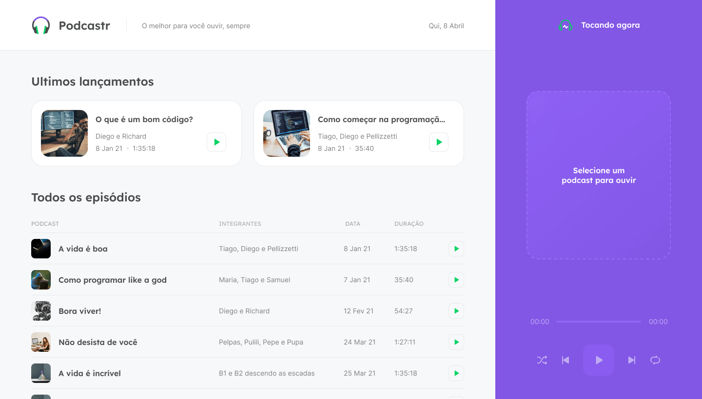
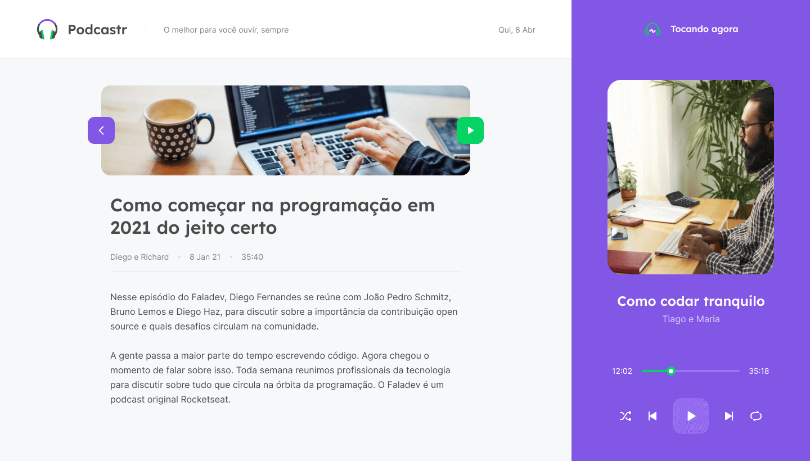

<p align="center">
   
</p>


<p align="center">	
   <a href="https://www.linkedin.com/in/rafael-yokoyama/">
      
   </a>

  <a aria-label="Completed" href="https://nextlevelweek.com/episodios/react/1/edicao/5">
    </img>
  </a>
  
  

</p>
<p align="center">
   
</p>


<div align="center">
  <sub>The NLW #5 project. Built with 💜  by
    <a href="https://github.com/Rafael-Yokoyama">Rafael Yokoyama</a>
   
      
  
  </sub>
</div>


<h2 align="left"> 📥 Layout available for download at: </h2>
<p align="center">
    <a title="Download .fig Web" href="https://www.figma.com/file/8YUFtslOXp3Lu9BFLugaBQ/Podcastr-(Copy)?node-id=160%3A2908">
        
    </a>
   
</p>


<p align="center">
   

</p>

<p align="center">
  

</p>


# :eyes: Demo Website
 

# :computer: Technologies
This project was made using the follow technologies:

* [Typescript](https://www.typescriptlang.org/)      
* [React](https://reactjs.org/)      
* [Next.js](https://nextjs.org/)      
     

# :rocket: Features

* Listen to podcasts.

# :construction_worker: How to run
```bash
# Clone Repository
$ git clone https://github.com/Rafael-Yokoyama/-podcastr-nlw.git
```

### 💻 Run Web Project

```bash
# Install Dependencies
$ yarn install 

# Run Aplication
$ yarn dev
```
Go to http://localhost:3000/ to see the result.


# :closed_book: License


Made with love by [Rafael Yokoyama](https://github.com/Rafael-Yokoyama) 🚀.
This project is under the [MIT license](./LICENSE).


